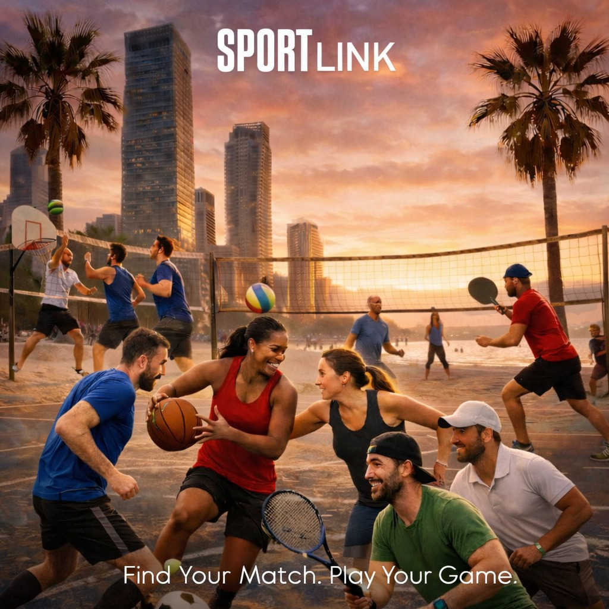

  
  

  

    <a href="#about">About</a> •
    <a href="#tech-stack">Tech Stack</a> •
    <a href="#roadmap">Roadmap</a> •
    <a href="docs/PROJECT_CHARTER.md">Research & Vision</a>
  

---

## 📖 About
**SportLink** is a location-based social platform designed to transform fragmented sports communities into a single, efficient ecosystem.

Instead of relying on scattered WhatsApp groups, SportLink enables users to instantly create or join games ranging from football to yoga based on:
* 📍 **Precise Location** (Google Maps Integration)
* 🕒 **Real-Time Availability**
* ⚖️ **Verified Skill Levels**

> *Read more about our Vision and MVP Scope in the [Project Charter](docs/PROJECT_CHARTER.md).*

## 🛠 Tech Stack
We rely on a robust, scalable stack optimized for location-based services. Click on the technologies to read our architectural decisions:

| Component | Technology | Reasoning |
| :--- | :--- | :--- |
| **Frontend** | [**React Native**](docs/frontend_decision.md) | Cross-platform mobile performance with native map integration. |
| **Backend** | [**Node.js**](docs/backend_decision.md) | Scalable API handling and real-time capabilities. |
| **Database** | [**PostgreSQL**](docs/database_decision.md) | Relational integrity with **PostGIS** for advanced geospatial queries. |
| **Maps** | **Google Places API** | Validated solution for retrieving courts and facility data. |

## 📅 Roadmap
| Date | Milestone | Status |
| :--- | :--- | :--- |
| Jan 11, 2026 | **Tech Validation** | ✅ Completed |
| Jan 18, 2026 | [**High-Level Design (HLD)**](docs/HLD.md) | ✅ Ready |
| Mar 15, 2026 | **Proof of Concept (PoC)** | ⏳ Pending |
| May 10, 2026 | **Full Prototype** | ⏳ Pending |
| Sep 08, 2026 | **Final Submission** | ⏳ Pending |

## 👥 The Team
* **Amit Oved** - [GitHub](https://github.com/Am1its)
* **Gal Libal** - [GitHub](https://github.com/gallibal)

---
*Developed as part of the MTA Computer Science School - Software Entrepreneurship Workshop 2025*
