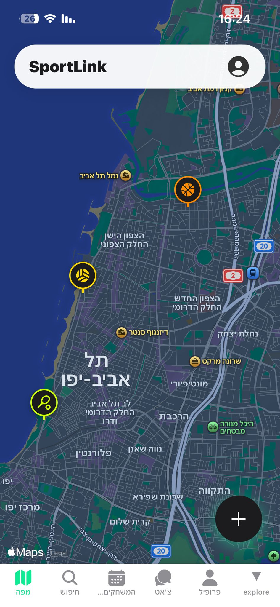

# SportLink - App Flow & Core Features

**Status:** Full Prototype — Sprint 11 complete  
**Target Audience:** Tel Aviv Amateur Athletes

---

## 🎨 Design System
All screens use tokens from `frontend/constants/theme.ts` — never raw hex values.
- **Colors:** semantic palette (bg, surface, surface2, text hierarchy, accent #0FEA95, error, warning, etc.)
- **Spacing:** 8-step scale (xs:4 → huge:48). **Radius:** sm:8 → pill:100. **Shadow:** card + medium presets.
- **Skeletons:** `SkeletonLoader.tsx` exports shaped shimmer loaders for Discover, Games, Profile, Chat — replace `ActivityIndicator` in all tab screens.

---

## 📱 Core Application Screens (Bottom Navigation)

Tab bar: dark (`#1C1C1E`) with subtle border, height 62.

### 1. 🗺️ Map (Home)
- Real GPS location via `expo-location`; fallback to Tel Aviv center.
- Fetches courts from Google Places (4 parallel queries, deduped) + community games from `/api/games`.
- **Custom markers:**
  - Outdoor courts: hollow dashed ring with sport color.
  - Gyms/studios: filled tinted circle.
  - Community games: sport-colored marker with level badge; clusters into a green count-circle at low zoom.
- **Filter bar:** All / Games / Courts + 9 sport sub-chips (Basketball, Tennis, Volleyball, Football, Yoga, Gym, Studio, Footvolley, Swimming).
- **FAB:** "Drop Pin" (tap map to place) or "Choose Court" (bottom-sheet court picker).
- **Bottom card states:** Your Game / Join Game (spring haptic animation) / Full / Public Court.
- Past games hidden from map. Court markers → "View Details" → `court-detail` screen.

### 2. 🔍 Discover
- Searchable, filterable game list (title, location, sport type).
- **Modal-based filters:** sport + radius buttons open centered Modal overlays. 9 sports. Radius: Any/1km/5km/10km/20km.
- **GameCard:** 3px sport-color accent bar (left edge), photo top, sport label in sport color, compact meta row, full-width pill Join button. Urgency badge for ≤2 spots.
- Button states (priority): "Your Game" → "✓ Joined" → "Full" → "Join Game". `is_joined` seeded from backend, persisted on join.
- `DiscoverSkeleton` during load. Pull-to-refresh.

### 3. 📅 My Schedule
- **Upcoming** section: game cards with 3px accent bar. Host: Edit / Delete / Chat. Joined: Leave / Chat.
- **History** section: past games — host → "Close & Rate"; completed → "Rate Players" + "Results".
- `GamesSkeleton` during load. Pull-to-refresh.

### 4. 💬 Chat
- Two tabs: **Events** (game chats with sport icon + last message) and **Friends** (DM conversations, unread badge on tab).
- `ChatSkeleton` during load. Unread rows bold (`fontWeight:'800'`). Unread dot rendered outside `overflow:hidden`.

### 5. 👤 Profile
- **Hero band** with 3-orb design (layered blobs tinted by top sport color). Overlapping avatar (marginTop: -52).
- `ProfileStatsSkeleton` during load.
- Horizontal 4-stat bar: Total Games / Hosted / Joined / Karma.
- **Sport chips** (horizontal scroll): active preferences with skill level + favorite heart.
- Inline edit: username, bio, avatar (picker uses `['images']`).
- **Menu:** Leaderboard, Friends, Discover Players, Sport Preferences, Notifications (unread badge), Notification Settings, Sign Out.

---

## 🚀 Key Features

### Real-Time Chat (socket.io)
- When a user opens a game chat, the client connects via socket.io and joins room `game_<id>`.
- Messages appear instantly for all participants — no polling.
- Falls back to REST POST if the socket is disconnected.

### In-App Notification Inbox
- Every push notification (join, friend request, game cancel, reminder) is also persisted in the `Notifications` table.
- Profile screen shows a red unread badge on the Notifications menu item.
- Inbox lists up to 50 recent notifications; tap to mark read; "Mark all read" button.

### Game Photo
- Hosts can attach a 16:9 court or action photo when creating or editing a game.
- Photo stored as base64 in the `Games.photo` column.
- Displayed on Discover cards and editable in the modal.

### Radius-Based Game Search
- Discover screen offers distance chips (1 km / 5 km / 10 km / 20 km).
- Selecting a distance requests GPS permission and sends `?lat=&lng=&radius_km=` to the backend.
- Backend filters using the Haversine formula with `HAVING distance_km <= ?`.

### Player-Profile Friend Button
- Viewing any player's profile shows their karma and stats.
- A context-aware button: **Add Friend** / **Request Sent** / **Accept Request** / **Remove Friend**.
- `GET /api/users/:id` returns `friendship_status` and `friendship_id` so the button renders correctly with no extra request.

### Karma & Ratings
- **Host:** After a game, marks each participant Arrived (✅ +1 karma) or No-Show (❌ -1 karma).
- **Players:** Rate each other on Sportsmanship, Punctuality, Communication (thumbs up/down) and Skill (1–5 stars).
- Karma computed live in SQL — never stale.

### Push Notifications
- Sent for: new player joins your game, game cancelled, friend request sent/accepted, game starting in ~30 min.
- Registered via `expo-notifications`; token stored in `Users.push_token`.
- Game-start reminders: `setInterval` every 60 s on the backend.

### Friends System
- Search users by username prefix; send / accept / reject requests.
- When creating a game, accepted friends appear as invite chips → added as participants automatically.
- Friend requests and acceptances each trigger a push notification.

### Onboarding
- 4-step wizard on first login: **Photo** → **Bio** → **Sports** (9 options, ≥1 required) → **Levels** (per-sport 5-dot skill + heart favorite, defaults to 3).
- 4-segment progress bar at top. Pill buttons. Sport tiles 1.1 aspect ratio.
- Completes by `PUT /me` (avatar, bio, `onboarding_complete:true`) + `PUT /sport-preferences`.

### Leaderboard
- Top 20 users by karma.
- Podium view for ranks 1–3 (medal + platform block + larger avatar).
- Current user highlighted with a "You" badge.

---

## 🔐 Authentication

- JWT issued on register/login with a **90-day expiry** (extended from 7-day in Sprint 7).
- Token stored in `AsyncStorage`; read on cold start for instant re-auth.
- Any 401 response triggers global `_onUnauthorized` → `logout()` → redirect to `/login`.
- Routing gate in `index.tsx`: no token → `/login`; token + `!onboarding_complete` → `/onboarding`; else → `/(tabs)`.

---

## 📸 App Screenshot

  

