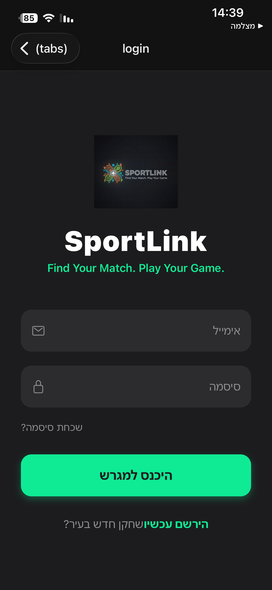

# SportLink - Authentication & Player Trust Model

To address the challenges of player identity and skill reliability, SportLink implements a multi-layered Authentication and Verification system.

## 🛡️ 1. Identity Verification
* **Initial Gate:** Mandatory login/register flow (now implemented in the UI).
* **Secure Auth:** Integration with Firebase/Auth0 to ensure each account is tied to a unique verified entity.
* **Profile Ownership:** Each player has a persistent identity, preventing "anonymous trolling" or hit-and-run game cancellations.

## ⚖️ 2. The Skill Level Reliability System
One of our core solutions to the "Reliability" challenge is the **Dynamic Skill Calibration**:
1. **Self-Declaration:** Upon registration, users select a level (1-5).
2. **Community Feedback:** After each match, participants provide a 1-click rating of their teammates/opponents' actual level.
3. **Algorithmic Adjustment:** The system calculates a weighted average. If a user consistently underperforms or overperforms their declared level, their profile level adjusts automatically.

## 🌟 3. Karma Score (The Reliability Engine)
To prevent "Ghosting" and ensure games actually happen:
* **Attendance Tracking:** Hosts confirm attendance at the end of a match.
* **Karma Impact:** High attendance = High Karma (Gold Badge). Last-minute cancellations = Low Karma.
* **Access Control:** High-demand games or "Pro" level matches can be restricted to players with a Karma score above 90%.

---

## 📸 Application Screenshot

  

