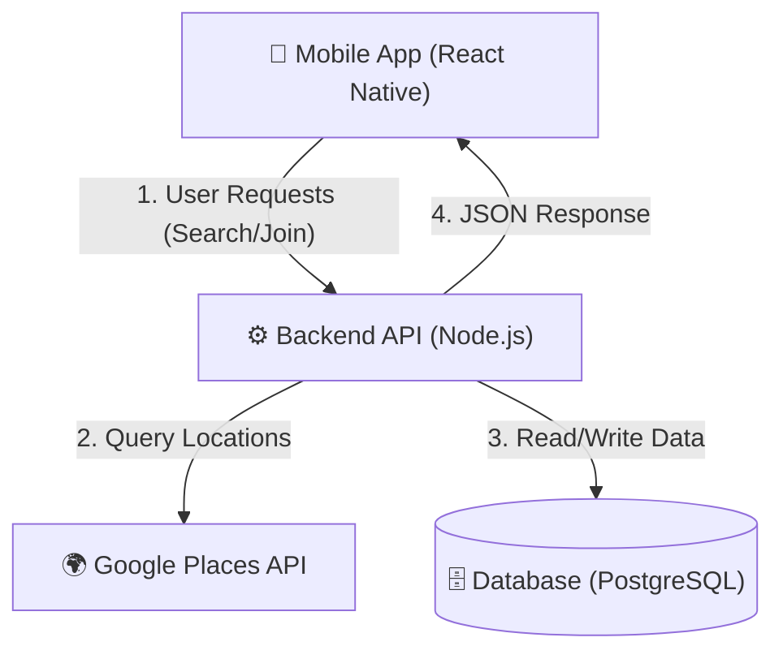
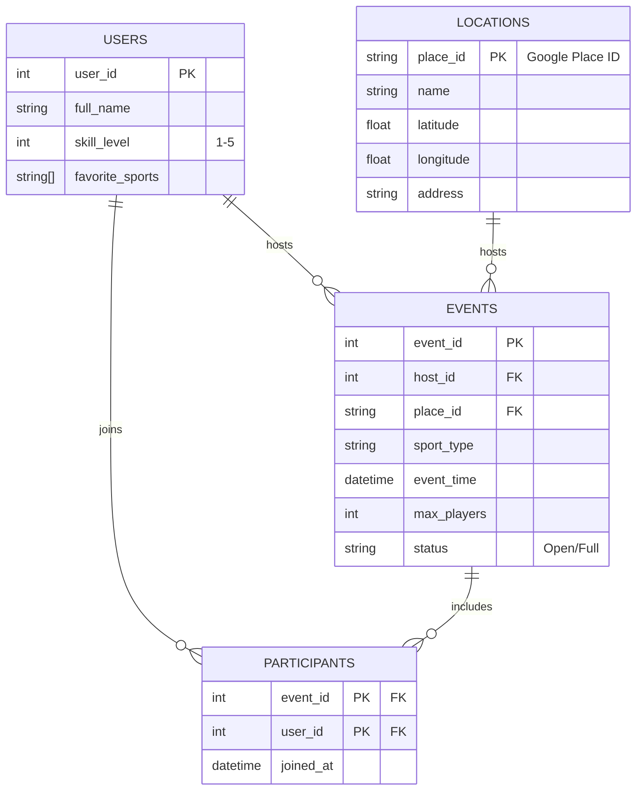

# High-Level Design (HLD) - SportLink

> **Note:** This technical design is derived from the User Personas and Stories defined in the [Product Definitions](PRODUCT_DEFINITIONS.md). The architecture is optimized to support location-based discovery (Persona: "Newcomer") and real-time event management (Persona: "Organizer").

## 1. System Architecture
The system follows a classic **Client-Server** architecture optimized for location-based services.

---

## 2. Database Design (ERD)
We use a **Relational Model** to ensure data integrity between Users, Events, and Locations.

### Key Design Decisions:
1.  **Locations Table**: We store locations using their unique **Google Place ID** as the Primary Key. This prevents duplicate venues and allows easy re-fetching of updated data from Google.
2.  **Participants Table**: A junction table that manages the Many-to-Many relationship between Users and Events, preventing race conditions when joining a game.

---

## 3. Core API Endpoints (Draft)

| Method | Endpoint | Description |
| :--- | :--- | :--- |
| **GET** | `/api/events/nearby` | Find events within X km radius (uses PostGIS). |
| **POST** | `/api/events` | Create a new game at a specific location. |
| **POST** | `/api/events/:id/join` | Add current user to the participant list. |
| **GET** | `/api/locations/search` | Proxy request to Google Places API (to hide API keys). |
