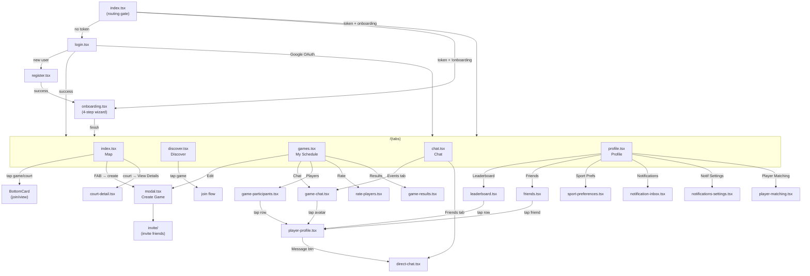
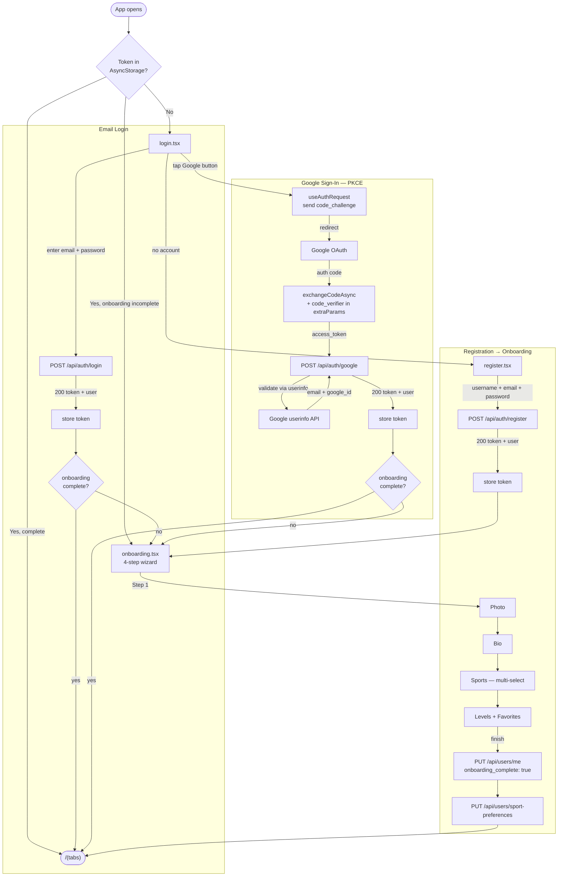
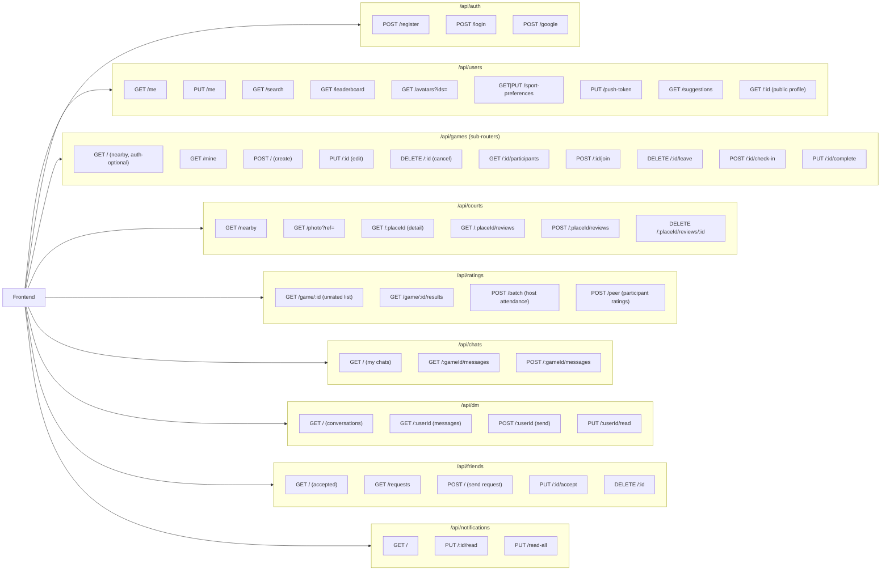
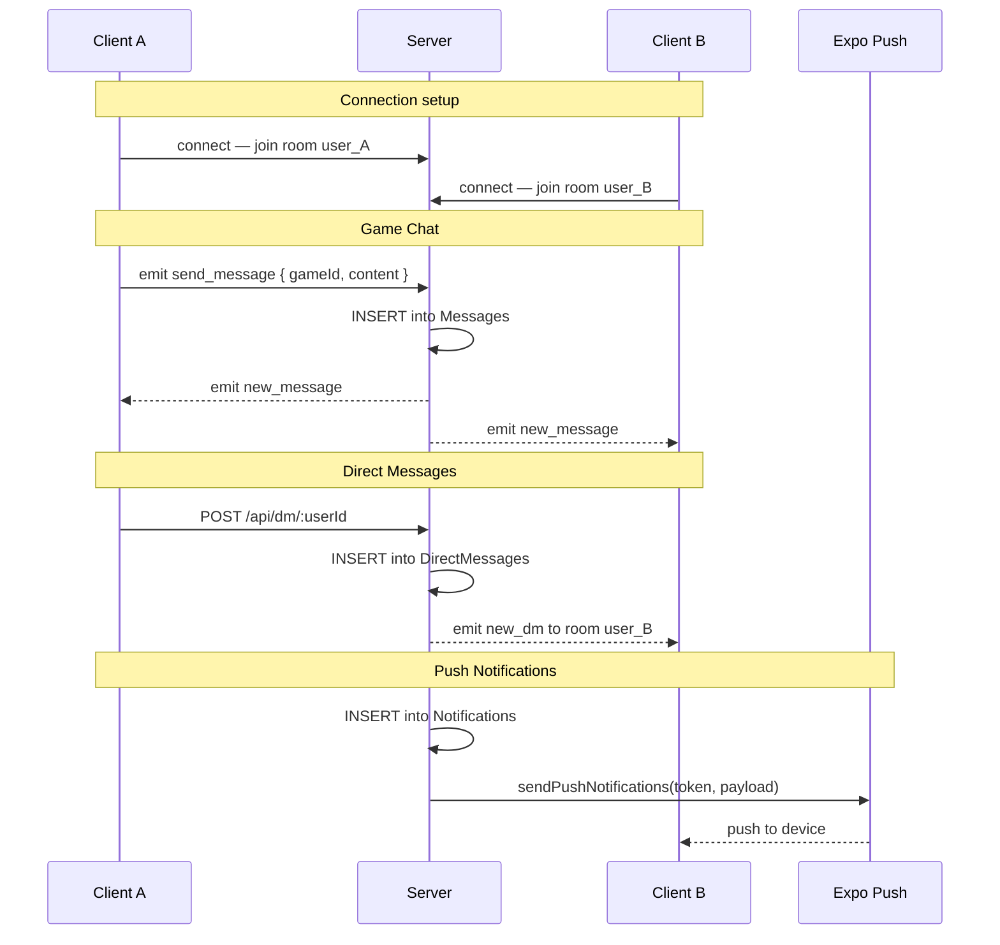
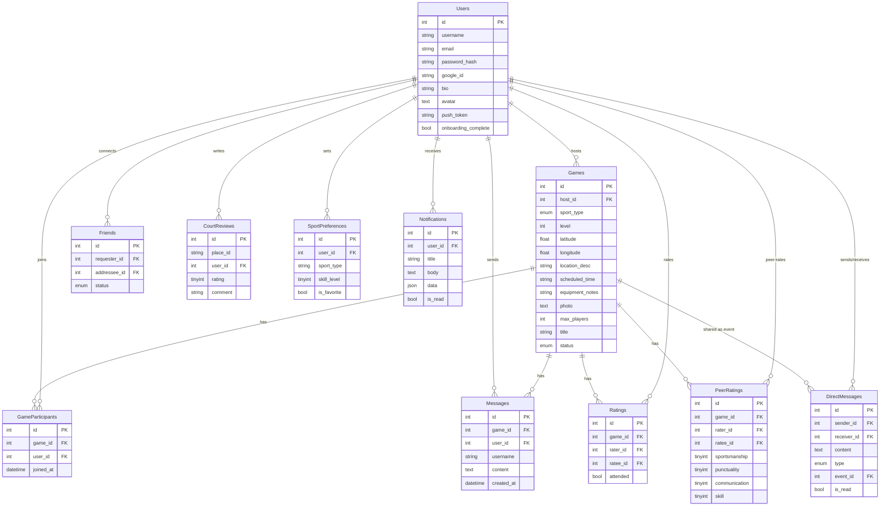
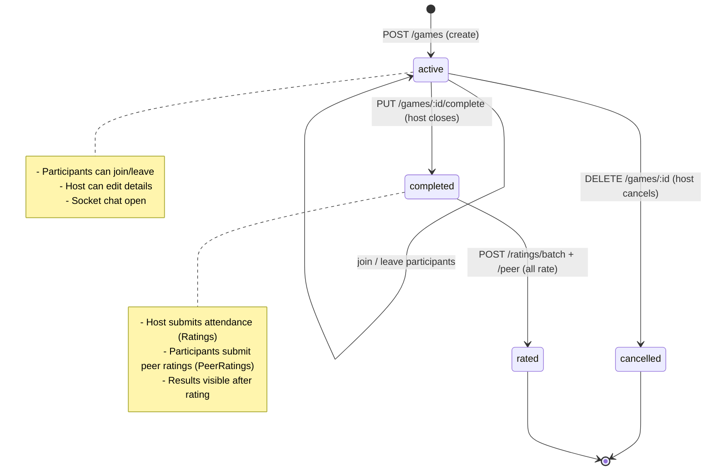
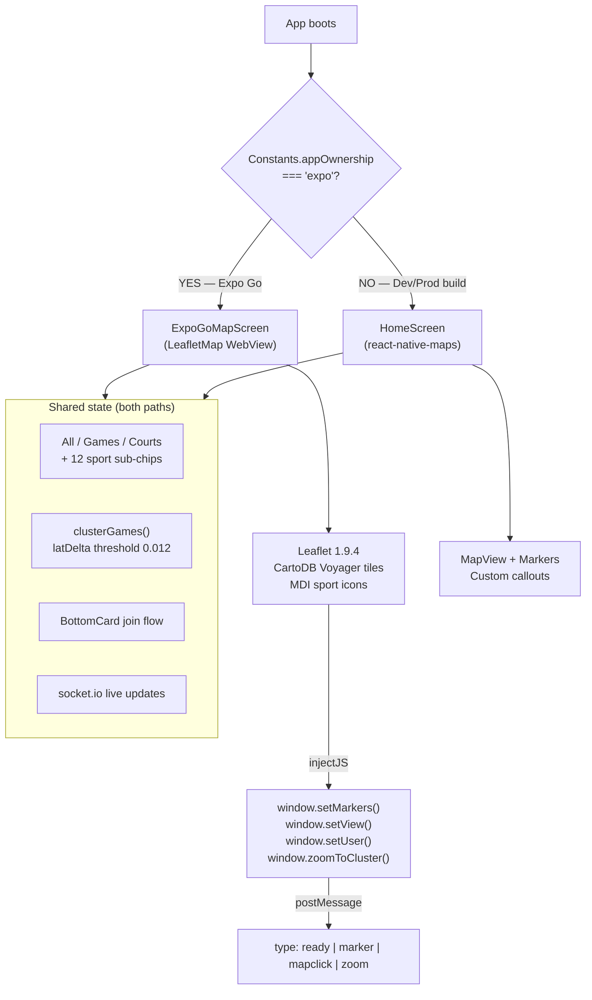

# SportLink — Architecture Diagrams

Paste any block into [mermaid.live](https://mermaid.live) or view natively in GitHub / Obsidian / Notion.

---

## 1. Screen Navigation Flow

---

## 2. Auth Flow

---

## 3. API Route Map

---

## 4. Real-Time Events (Socket.io)

---

## 5. Database Entity Relationships

---

## 6. Game Lifecycle State Machine

---

## 7. Map Screen Logic (Dual Code Path)

